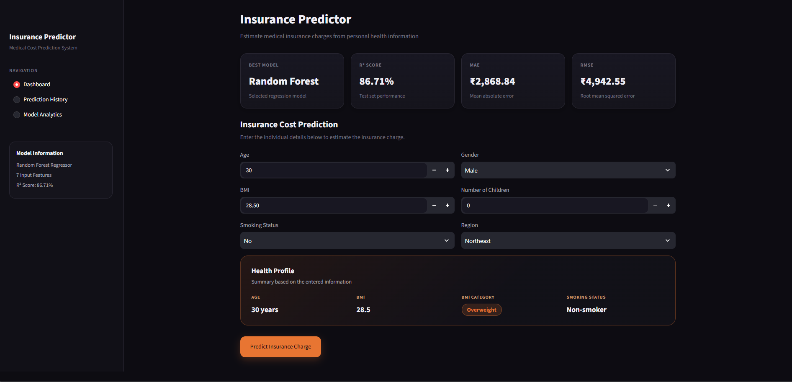

# Insurance Predictor

A machine learning based web application that predicts medical insurance charges using a trained Random Forest Regression model.

The application provides a premium Streamlit dashboard where users can enter personal and health-related information and receive an estimated insurance charge.

---

## Dashboard Preview



---

## Features

### Dashboard

- Premium dark-themed dashboard
- Medical insurance charge prediction
- Age input
- BMI input
- Gender selection
- Number of children
- Smoking status
- Region selection
- Live Health Profile
- BMI category detection
- Estimated insurance charge

### Prediction History

- Stores predictions during the current session
- Displays:
  - Age
  - Gender
  - BMI
  - Children
  - Smoking Status
  - Region
  - Predicted Charge

### Model Analytics

- R² Score
- Mean Absolute Error (MAE)
- Root Mean Squared Error (RMSE)
- Feature importance
- Feature importance visualization

---

## Machine Learning Model

The application uses a:

**Random Forest Regressor**

The trained model is stored in:

```text
insurance_model.pkl
```

The model predicts the target variable:

```text
charges
```

### Model Input Features

The model expects exactly these 7 features:

```text
age
is_Female
bmi
children
is_smoker
region_southeast
bmi_category_Obese
```

The feature order is enforced during prediction to ensure compatibility with the trained model.

---

## Model Performance

The Random Forest model achieved the following performance on the test dataset:

| Metric | Score |
|---|---:|
| R² Score | 86.71% |
| MAE | ₹2,868.84 |
| RMSE | ₹4,942.55 |

### R² Score

The model achieved an **R² score of 0.8671 (86.71%)**, indicating that the model explains approximately 86.71% of the variance in the test-set insurance charges.

> Note: Since this is a regression problem, R² Score is used instead of classification accuracy.

---

## Feature Importance

The Random Forest model identifies the following relative feature importance:

| Feature | Importance |
|---|---:|
| is_smoker | 59.99% |
| age | 15.18% |
| bmi | 12.26% |
| bmi_category_Obese | 7.59% |
| children | 2.75% |
| is_Female | 1.16% |
| region_southeast | 1.06% |

The application also pulls feature importance directly from:

```python
model.feature_importances_
```

---

## BMI Classification

The application automatically determines BMI category from the entered BMI.

| BMI | Category |
|---|---|
| Below 18.5 | Underweight |
| 18.5 – 24.9 | Normal |
| 25 – 29.9 | Overweight |
| 30 or above | Obese |

The BMI category is also converted into the model feature:

```text
bmi_category_Obese
```

---

## Prediction Feature Mapping

The user-friendly inputs are converted into the numerical features expected by the model.

### Gender

```text
Female → 1
Male → 0
```

### Smoking Status

```text
Yes → 1
No → 0
```

### Region

```text
Southeast → 1
All other regions → 0
```

### BMI Category

```text
BMI >= 30 → 1
BMI < 30 → 0
```

---

## Tech Stack

- Python
- Streamlit
- Pandas
- Scikit-learn
- Joblib
- HTML
- CSS

---

## Project Structure

```text
Insurance_Predictor/
│
├── app.py
├── insurance_model.pkl
├── README.md
├── screenshot.png
└── .gitignore
```

---

## Installation

Clone the repository:

```bash
git clone https://github.com/faizanfatmi/insurance_Data_Analysis.git
```

Navigate to the project directory:

```bash
cd Insurance_Predictor
```

Install the required packages:

```bash
pip install streamlit pandas scikit-learn joblib
```

---

## Run the Application

Start the Streamlit application:

```bash
streamlit run app.py
```

The application will open in your browser.

---

## How It Works

```text
User Input
    ↓
Data Preprocessing
    ↓
Feature Transformation
    ↓
7 Model Features
    ↓
Random Forest Regressor
    ↓
Predicted Insurance Charge
    ↓
Dashboard Result
```

---

## Model Loading

The trained model is loaded using Joblib and cached using Streamlit:

```python
@st.cache_resource
def load_model():
    return joblib.load("insurance_model.pkl")
```

This ensures that the model is loaded efficiently without repeatedly loading it during Streamlit reruns.

---

## Prediction

The application creates the model input using the exact feature order:

```python
input_data = pd.DataFrame({
    "age": [age],
    "is_Female": [is_female],
    "bmi": [bmi],
    "children": [children],
    "is_smoker": [is_smoker],
    "region_southeast": [region_southeast],
    "bmi_category_Obese": [bmi_obese]
})

prediction = model.predict(input_data)[0]
```

---

## Interface

The application contains three main sections:

### 1. Dashboard

Used to enter user information and generate an insurance charge prediction.

### 2. Prediction History

Displays previous predictions made during the current Streamlit session.

### 3. Model Analytics

Displays model performance metrics and feature importance.

---

## Important Note

This application provides an **estimated insurance charge** based on the trained machine learning model and should not be considered an actual insurance quotation.

---

## Future Improvements

Possible future improvements include:

- Deploying the application online
- Adding persistent prediction history
- Adding user authentication
- Adding database integration
- Improving model performance
- Adding additional regression models for comparison
- Adding interactive prediction analytics

---

## Author

**Faizan Fatmi**

---

## License

This project is licensed under the MIT License.

Copyright (c) 2026 Faizan Fatmi

Permission is hereby granted, free of charge, to any person obtaining a copy
of this software and associated documentation files, to use, copy, modify,
merge, publish, distribute, sublicense, and/or sell copies of the software,
subject to the conditions of the MIT License.
